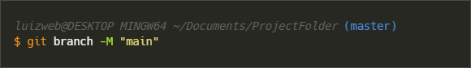

### Passo a passo como usar o Git e o Github
##

**O que é o Git?**

O Git é um sistema de controle de versão de arquivos, principalmente utilizado em equipes de desenvolvimento de softwares. O controle de versão é muito importante quando várias pessoas estão editando o mesmo código em diferentes partes do arquivo ou do projeto, por exemplo.

Mantém um histórico de qual alteração foi feita em um arquivo, quem alterou, quando e por que foi realizada essa alteração, para consultas futuras.

A instalação do Git é feita localmente no computador de cada desenvolvedor.

Git é diferente de Github.

Documentação de referência: https://git-scm.com/doc

 

**Instalação do Git**

Site para download e instalação do Git: https://git-scm.com/

 

**O que é o Github?**

O Github hospeda projetos que usam o Git.

O Github trabalha com repositórios (diretórios/pastas onde são armazenados nossos projetos).

Compartilhar projetos, interagir e colaborar com outros desenvolvedores ao redor do mundo, criar e publicar um portifólio, também são funcionalidades do Github.

 
 

**Comandos**

git init

 
 

(master)

 
 

git add

 
 

git add (all)

 
 

git status

 
 

git commit

 
 

git branch

 
 

git add (all)

 
 

git remote

 
 

git push

 
 

git checkout

 
 

git merge

 
 

git clone

 
 

git pull

 
 

remover

 
 

<!-- 
~~~bash
$ git push origin main
~~~
-->

 
 

**Links**

Git Cheatsheet: https://ndpsoftware.com/git-cheatsheet.html  
Guia: https://training.github.com/downloads/pt_BR/github-git-cheat-sheet/

