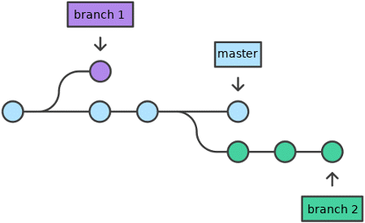
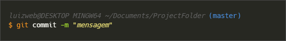
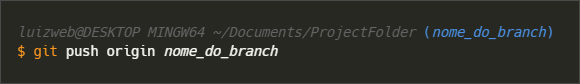

### Passo a passo como usar o Git e o Github
##

**O que é o Git?**

O Git é um sistema de controle de versão de arquivos, principalmente utilizado por equipes de desenvolvimento de softwares. O controle de versão é muito importante quando várias pessoas estão editando o mesmo código em diferentes partes do mesmo arquivo ou projeto, por exemplo.

O Git mantém um histórico de qual alteração foi feita em um arquivo, quem alterou, quando e por que foi realizada essa alteração, para consultas futuras.

A instalação do Git é feita localmente no computador.

Git é diferente de Github.

Documentação de referência: https://git-scm.com/doc

 

**Instalação do Git**

Site para download e instalação do Git: https://git-scm.com/

 

**O que é o Github?**

O Github hospeda projetos que usam o Git.

O Github trabalha com repositórios (diretórios/pastas onde são armazenados nossos projetos).

Compartilhar projetos, interagir e colaborar com outros desenvolvedores ao redor do mundo, criar e publicar um portifólio, também são funcionalidades do Github.

 
 

**Conceitos**

__Repositório__: diretórios/pastas onde são armazenados os arquivos/projetos  

 
 

__Branch__: ramificação a partir da linha cronológica principal durante o desenvolvimento de um sistema/projeto. 
Linha cronológica do desenvolvimento.  
  
Por exemplo, você está desenvolvendo um site em Html e CSS. Você pode fazer uma ramificação para desenvolver só o cabeçalho (head), outra para fazer o corpo (body), outra para um segundo desenvolvedor fazer um botão etc.  
No final, quando a funcionalidade da ramificação estiver pronta, podemos juntar (merge) a ramificação (branch) à linha do tempo do projeto principal (main/master). 
  
 
 

__Commit__: salva uma versão das alterações que foram feitas nos arquivos de um projeto. São as versões. “São os pontos na história”.
 
 

__Merge__: junção da ramificação (branch) à linha do tempo do projeto principal (main/master).
 
 

__Remote__: faz a conexão do repositório que está no meu computador com o _Github_.
 
 

__Push__: 'Empurra' os arquivos do repositório local que já receberam o _commit_ e envia para o _Github_. Publica e cria uma versão no Github. “É o _commit_ para o _Github_”.
 
 

__Pull__: o contrário do push. Ele 'puxa' o que está no repositório do Github para o seu computador.
 
 

**Roteiro** (revisar)

Roteiro:
- criar uma pasta no computador com o nome do projeto
- clicar com o botão direito dentro da pasta criada e clicar em “Abrir com Code”
- criou um novo arquivo no VS Code chamado “Readme.md” (md é a extensão para markdown, linguagem de marcação) – o arquivo Read.me contem as instruções do projeto
- editar o arquivo Read.me
- Dentro da mesma pasta que foi criada para o projeto, clique com o botão direito do mouse e após em “Git Bash Here” para abrir o terminal “Git Bash”

 
 

**Comandos**

git init – inicializa um novo repositório vazio no branch principal (master)  
  
uma pasta oculta “.git” é criada no diretório (não apagar) 
 
 

(master) 

 
 

git add 'nome do arquivo' – adiciona os arquivos para uma staging area (área de preparação).  OU
git add . – adiciona todos os arquivos para a staging area  

 
 

git add (all) 

 
 

git status – mostra o status atual   

 
 

git commit -m 'mensagem' – salva a versão do arquivo com as últimas alterações. O parâmetro -m escreve uma mensagem/informação sobre o commit.  

 
Obs.: o Git tem mudado a nomenclatura do Branch principal. O padrão é “master”, mas pode aparecer também como “main”.
 

git branch  

 
 

git add (all)  

 
 

git remote  

 
 

git push  

 
 

git checkout  

 
 

git merge  

 
 

git clone  

 
 

git pull  

 
 

remover  

 
 

<!-- 
~~~bash
$ git push origin main
~~~
-->

 
 

**Links**

Git Cheatsheet: https://ndpsoftware.com/git-cheatsheet.html  
Guia: https://training.github.com/downloads/pt_BR/github-git-cheat-sheet/

